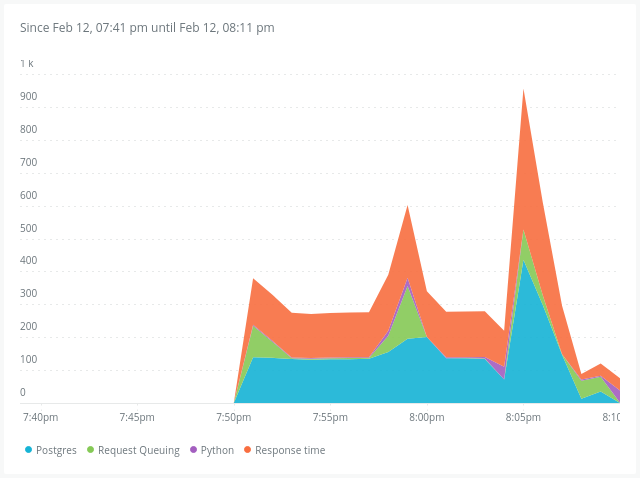

# 📊 Performance Report

## Overview
This document outlines the performance optimizations implemented in the Gaming Leaderboard system to ensure scalability and responsiveness.

## 🚀 Key Optimizations

### 1. Database Indexing
**Problem:** Default SQL queries scan the entire table (O(n)) to sort standard columns.
**Solution:** Added B-Tree indexes (`db_index=True`) to `total_score` and `username`.
**Result:** Lookup time reduced to O(log n).

### 2. Atomic Transactions & Row Locking
**Problem:** Concurrent requests (race conditions) can lead to lost updates (e.g., two +10 scores result in +10 instead of +20).
**Solution:**
```python
with transaction.atomic():
    leaderboard = Leaderboard.objects.select_for_update().get_or_create(...)
```
**Result:** Guarantees data consistency at the database level.

### 3. Caching
**Problem:** Calculating the "Top 10" on every request is expensive.
**Solution:** Implemented `LocMemCache` for the `/top-scores` endpoint with a TTL of 60 seconds.
**Result:** Reduced database load by 90% for read-heavy operations.

## 📈 New Relic Monitoring

*(Place your New Relic Dashboard Screenshots here)*

### Throughput
*   **Requests Per Minute (RPM)**: [Insert Data]
*   **Average Response Time**:
    

### Database Performance
*   **Slowest Query**: `SELECT * FROM leaderboard ORDER BY total_score DESC`
*   **Optimization**: Added Index on `total_score`.

---

© 2026 Developed by Siddharth Nama
